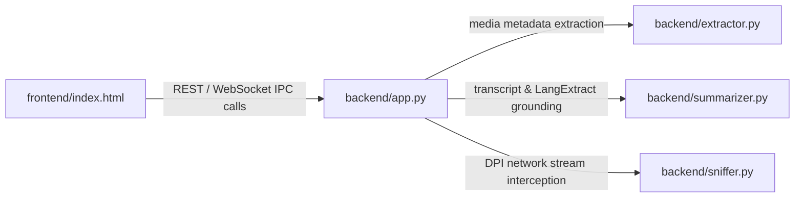

# 🗺️ Semantic Code Graph (Graft AST Map): media-downloader
**Stack:** FastAPI + yt-dlp + React/TS + Rust/Tauri Architecture
**Generated:** Auto-synced for Zero-Cost AI Agent Navigation

## ⚡ Core Pipeline Flows (Архитектурные цепочки вызовов)

## 📦 Индексированные Модули и Узлы (Nodes)
| Файл / Модуль | Тип | Ключевые методы / Эндпоинты |
| :--- | :--- | :--- |
| `backend/app.py` | Backend Engine | GET /, POST /api/analyze, POST /api/download, POST /api/offload |
| `backend/extractor.py` | Backend Engine | - |
| `backend/sniffer.py` | Backend Engine | - |
| `backend/summarizer.py` | Backend Engine | - |
| `frontend/postcss.config.js` | Frontend Component | - |
| `frontend/tailwind.config.js` | Frontend Component | - |
| `frontend/vite.config.ts` | Frontend Component | - |
| `frontend/src/App.tsx` | Frontend Component | - |
| `frontend/src/main.tsx` | Frontend Component | - |
| `frontend/src/types/ipc.ts` | Frontend Component | - |
